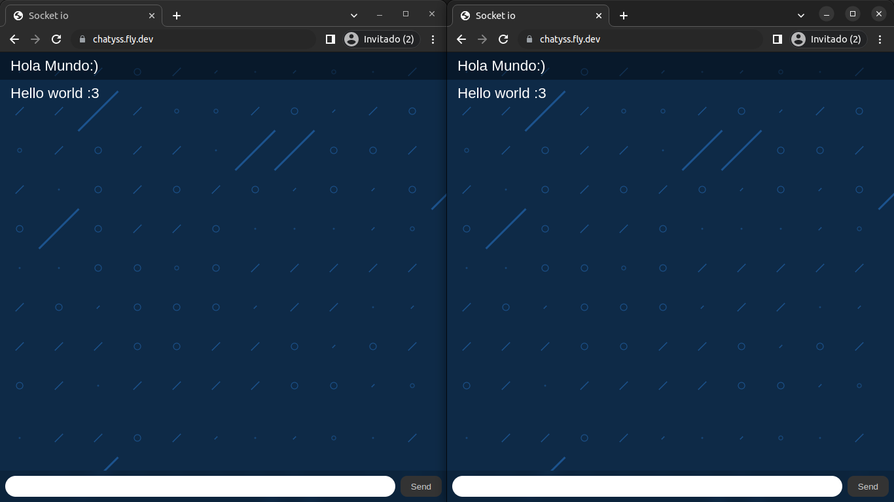

# chat-basico-socket-nodejs

Chat básico con socket en Node.js" es un repositorio que contiene una aplicación de chat en tiempo real desarrollada utilizando Node.js y el protocolo de comunicación de sockets.permite a los usuarios conectarse y comunicarse en salas de chat públicas, enviando mensajes de forma instantánea y visualizando las respuestas en tiempo real.
